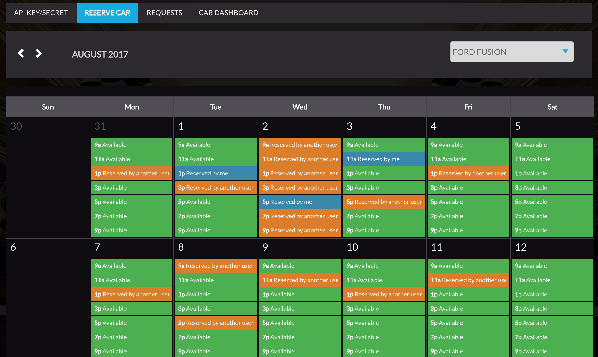
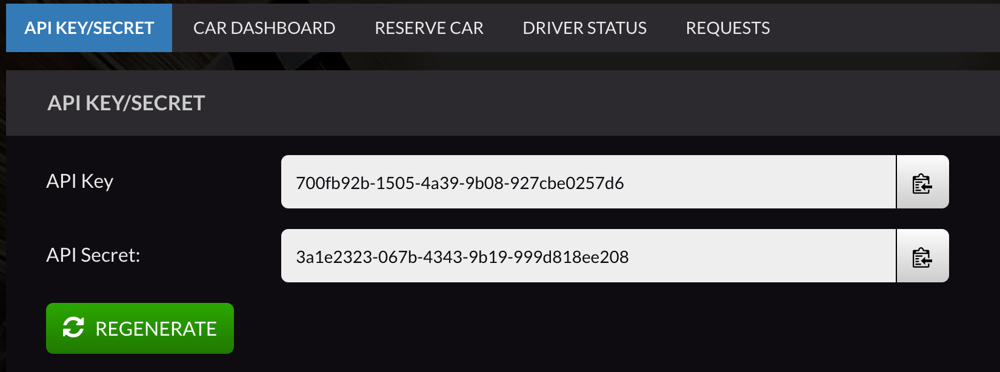

# USE AT YOUR OWN RISK!
READ CAREFULLY! 
This repository contains as-is, and not responsible for any harm, lost, damages or issues that may occur.

## Visual Threat SDK

It contains two versions of the same SDK. One for Java, and one for Python (2.7.x and 3.4+).
Examples are available in examples folders:
[for Python](./python/examples/)
and [for Java](./java/examples/src/main/java/). 

[Python API](./docs/python-api.md)  
[Java API](./docs/java-api.md)

#### 1. Test with a mocked car:
Let's start and write a basic example for both, python and java SDK.

We want to create a script, which will connect to a device,
send CAN message and show us IDs of all responses.

We will need to connect to VT cloud. API key and secret are required for this.
You can use the following API key and secret for testing. They allow you to connect to a mocked car, which is always available.

Key: `0dee4f2e-4b05-445d-b8ea-f8fe6b4b772c`

Secret: `1bcdd94c-a7ed-4e24-b601-6e8753ca3721`

Python version:
```python
# use test api key and secret
key = "0dee4f2e-4b05-445d-b8ea-f8fe6b4b772c"
secret = "1bcdd94c-a7ed-4e24-b601-6e8753ca3721"
# create api connection
api = API()
# get authentication token
token = api.authenticate(key, secret)

# get available devices, Device.TEST_DEVICE is always available
devices = api.get_connected_devices(token)
# find available device
device = None
for dev in devices:
    if dev.is_available_now():
        device = dev
        print("Selected car: " + device.name)
        break

# connect to it
cloud = api.connect_to_device(token, device)

# create CAN frame, with id 0x700 and data
can_frame = CANFrame(0x700, bytearray([0x1]))
# create request to send the can frame
# and collect all responses from CAN bus for 300 ms
request = Request(can_frame, 300)
try:
    responses = cloud.send_can_frames([request], CANResponseFilter.NONE())
    for response in responses:
        frame_ids = {hex(x.frame_id) for x in response.iterator()}
        print("Request ID: " + hex(response.request.frame_id))
        print("Unique ids: " + str(len(frame_ids)))
        print("IDs: " + str(frame_ids))
finally:
    cloud.close()
```

Java version:
```java
// create API object
final API api = API.get();

// use test api key and secret
final String key = "0dee4f2e-4b05-445d-b8ea-f8fe6b4b772c";
final String secret = "1bcdd94c-a7ed-4e24-b601-6e8753ca3721";

// authenticate
final Token token = api.authenticate(key, secret);
Device device = null;
for (final Device d : api.getConnectedDevices(token)) {
  // get available devices, Device.TEST_DEVICE is always available
  // compare with Device.getName if you want to use specific one
  if (d.isAvailable()) {
    device = d;
    break;
  }
}

// connect to found device and get VTCloud object
final VTCloud cloud = api.connectToDevice(device, token);

// create CAN frame, with id 0x700 and data
final CANFrame canFrame = new CANFrame(0x700, new byte[]{(byte) 0x01});
// create request to send the can frame
// and collect all responses from CAN bus for 300 ms
final Request request = new Request(canFrame, 300);
// send it, without any response filter
System.out.println("Sending CAN request...");
final Iterator<Response> responses = cloud.sendCANFrames(
    Collections.singletonList(request), CANResponseFilter.NONE);

final Set<String> receivedIDs = new HashSet<>();
// iterate through all request-responses pairs
while (responses.hasNext()) {
  final Response response = responses.next();
  final Iterator<CANFrame> responseFrames = response.getResponses();
  // iterate through response frames (you can use Response.getRequest to see request)
  while (responseFrames.hasNext()) {
    // get all unique IDs from received can frames
    receivedIDs.add("0x" + Integer.toHexString(responseFrames.next().getId()));
  }
}
cloud.close();

// print the result
System.out.println(String.format("%d different ids received: %s",
    receivedIDs.size(), receivedIDs.toString()));
```

For more details see examples inside the repository.

#### 2. Run examples
There are a few examples for Python and Java versions.

- Java  
To run Java examples you'll need maven installed. Install package and then run one of the examples.
You can pass parameters with `-Dexec.args=`. Run it from `java` folder:

```bash
mvn install
mvn compile exec:java -pl examples -Dexec.mainClass="Fuzzing" -Dexec.args="-k <key> -s <secret>"
```

There are 3 examples: Basic, Fuzzing and CompareSniffs. Check their code [here](./java/examples/src/main/java/).

- Python  
To run Python examples you'll need to install python package. Go to `python` folder and run
(you might need sudo/admin privileges):

```bash
python ./setup.py install
```

After this you can run examples, like this:

```bash
python examples/fuzzing.py -k <key> -s <secret>
```

There are 3 examples: basic, fuzzing, sniff.

#### 3. Test with a real car:
You need VT account to use real cars. Ask at info@visualthreat.com for one.

1. Go to [AutoX portal](https://visualthreat.net/autox/) and log in.
2. Go to "Reserve Car", select a device in the dropdown at the right and pick an available time slot.
   Click on it to reserve. The device is reserved for you on this time slot, so you can use it at that time with your API key.
   
3. Copy your API key and secret at "API Key/Secret" tab. You can always go there and regenerate it if you think
   you compromise it.
   
   
Feel free to go to Requests tab and ask for additional cars or any other questions.

#### 4. Important!
Don't forget to close Cloud object. Otherwise your connection to a device may hang and will close only after certain amount of time (about a minute in some cases).
All this time you won't be available to connect to this device with your key-secret pair.
