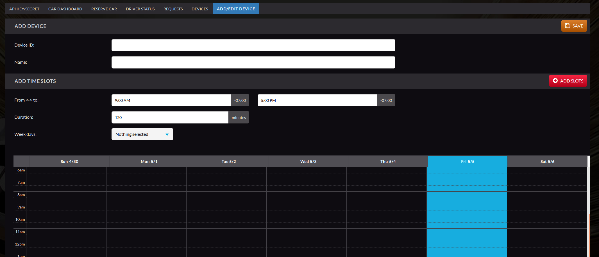
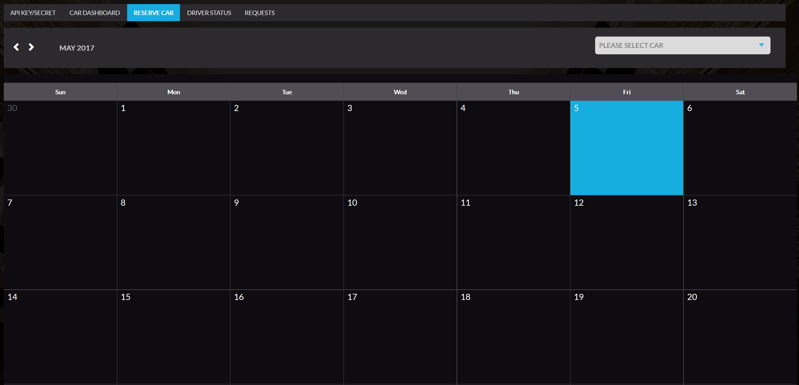

## Visual Threat SDK

It contains two versions of the same SDK. One for Java, and one for Python (2.7.x and 3.4+).
Examples are available in examples folders:
[for Python](./python/examples/fuzzing.py)
and [for Java](./java/examples/src/main/java/Fuzzing.java). 

#### 1. Test with a mocked car:
Let's start and write basic example for both, python and java SDK.

We want to create a script, which will connect to a device,
send CAN message and show us IDs of all responses.

We will need to connect to VT cloud. API key and secret are required for this.
Let's use test ones (they allow to connect to test device only, which is always available).

Key: 700fb92b-1505-4a39-9b08-927cbe0257d6
Secret: 47ac4af9-ed2a-4ed0-8d59-d431162a3032        

Python version:
```python
# use test api key and secret
key = "700fb92b-1505-4a39-9b08-927cbe0257d6"
secret = "47ac4af9-ed2a-4ed0-8d59-d431162a3032"
# create api connection
api = API()
# get authentication token
token = api.authenticate(key, secret)

# get available devices, Device.TEST_DEVICE is always available
devices = api.get_connected_devices(token)
# find available device
device = None
for dev in devices:
    if dev.is_available_now():
        device = dev
        print("Selected car: " + device.name)
        break

# connect to it
cloud = api.connect_to_device(token, device)

# create CAN frame, with id 0x700 and data
can_frame = CANFrame(0x700, bytearray([0x1]))
# create request to send the can frame
# and collect all responses from CAN bus for 300 ms
request = Request(can_frame, 300)
try:
    can_query = Query([request], CANResponseFilter.NONE())
    responses = cloud.send_can_query(can_query)
    for response in responses:
        frame_ids = {hex(x.frame_id) for x in response.iterator()}
        print("Request ID: " + hex(response.request.frame_id))
        print("Unique ids: " + str(len(frame_ids)))
        print("IDs: " + str(frame_ids))
finally:
    cloud.close()
```

Java version:
```java
// create API object
final API api = API.get();

// use test api key and secret
final String key = "700fb92b-1505-4a39-9b08-927cbe0257d6";
final String secret = "47ac4af9-ed2a-4ed0-8d59-d431162a3032";

// authenticate
final Token token = api.authenticate(key, secret);
Device device = null;
for (final Device d : api.getConnectedDevices(token)) {
  // get available devices, Device.TEST_DEVICE is always available
  // compare with Device.getName if you want to use specific one
  if (d.isAvailable()) {
    device = d;
    break;
  }
}

// connect to found device and get VTCloud object
final VTCloud cloud = api.connectToDevice(device, token);

// create CAN frame, with id 0x700 and data
final CANFrame canFrame = new CANFrame(0x700, new byte[]{(byte) 0x01});
// create request to send the can frame
// and collect all responses from CAN bus for 300 ms
final Request request = new Request(canFrame, 300);
// send it, without any response filter
System.out.println("Sending CAN request...");
final Iterator<Response> responses = cloud.sendCANFrames(
    Collections.singletonList(request), CANResponseFilter.NONE);

final Set<String> receivedIDs = new HashSet<>();
// iterate through all request-responses pairs
while (responses.hasNext()) {
  final Response response = responses.next();
  final Iterator<CANFrame> responseFrames = response.getResponses();
  // iterate through response frames (you can use Response.getRequest to see request)
  while (responseFrames.hasNext()) {
    // get all unique IDs from received can frames
    receivedIDs.add("0x" + Integer.toHexString(responseFrames.next().getId()));
  }
}
cloud.close();

// print the result
System.out.println(String.format("%d different ids received: %s",
    receivedIDs.size(), receivedIDs.toString()));
```

For more details see examples inside the repository.

#### 2. Test with a real car:
You need VT account to use real cars. Ask at info@visualthreat.com for one.

1. Go to https://visualthreat.net/autox/ and login.
2. Go to "Reserve Car", select a car in dropdown at the right and pick available time slot.
   Click on it to reserve. The car is reserved for you on this time slot, so you can use it at that time with
   your API key.
   
3. Copy you API key and secret at "API Key/Secret" tab. You can always go there and regenerate it if you think
   you compromise it.
   
   
Feel free to go to Requests tab and ask for additional cars or any other questions.
   
#### 3. For Admins

     a) Admin will create a car with time slots on Autox web portal


     b) A outside user should login to Autox web portal to generate api-key/api-secret and reserve an available car.



  
    c) Copy the generated api-key/api-secret and use this key to authenticate when connect to VTCloud.
